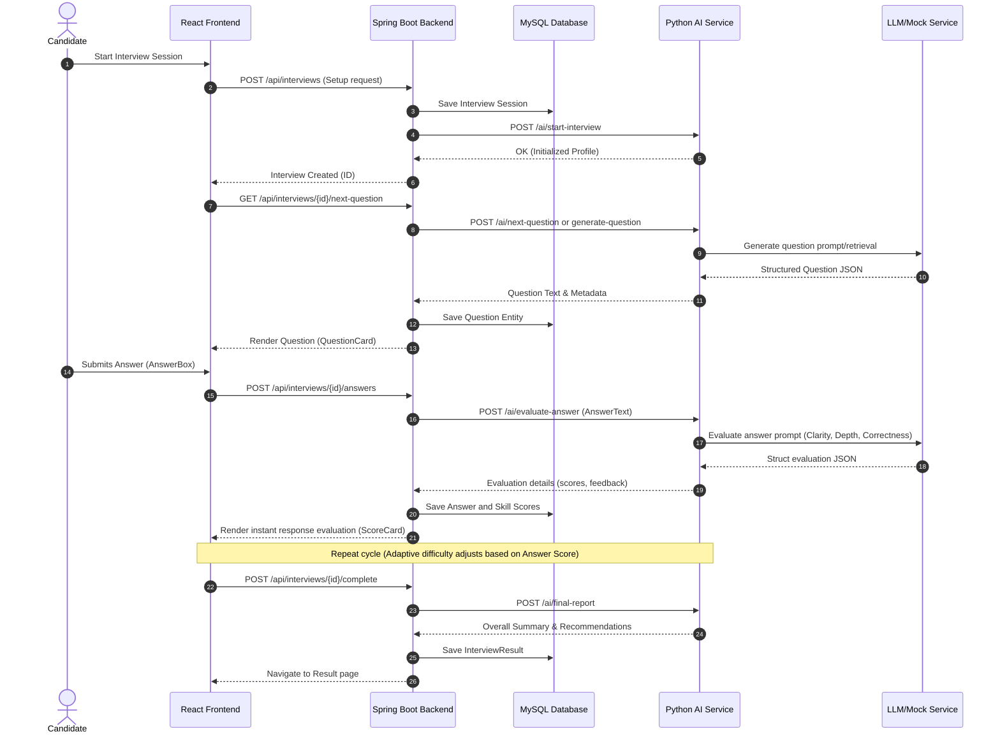

# Architecture Document - Coordinated AI Interview Panel

This document outlines the architectural structure, design flow, and technology layout of the Coordinated AI Interview Panel application.

## Overview

The system is split into three separate architectural components:
1. **React Frontend**: The client-side application where candidates log in, configure an interview session, read questions, input their answers, and review their scores.
2. **Spring Boot Backend**: The primary database access layer and orchestrator. It manages CRUD operations, handles request flow, maintains sessions, and routes requests to the AI Service.
3. **Python AI Service**: The lightweight AI and evaluation subsystem. It processes text answers, runs prompt-based assessments, generates questions from dataset banks or generative AI, and selects the next adaptive question based on scoring metrics.

---

## Architectural Flow

---

## Component Responsibilities

### Frontend (React + Vite)
- UI state management.
- Dynamic interfaces (e.g., chat style interaction, scoring meters, and setup forms).
- Communication with Spring Boot backend via Axios (`interviewApi.js`).

### Spring Boot Backend
- Orchestrates transactional boundaries.
- Models JPA entities (`User`, `Interview`, `Question`, `Answer`, `InterviewResult`).
- Exposes REST controllers for user access.
- Invokes Python AI Service endpoints asynchronously or synchronously via REST client templates.
- Enforces relational validation and persists data in MySQL.

### Python AI Service
- Independent service optimized for machine learning tasks.
- FastAPI routes for quick latency responses.
- Pydantic models for request/response serialization.
- Embeds RAG workflows (embeddings, retriever, vector stores) and prompting pipelines.
- Supports adaptive query logic based on historic correctness scores.
